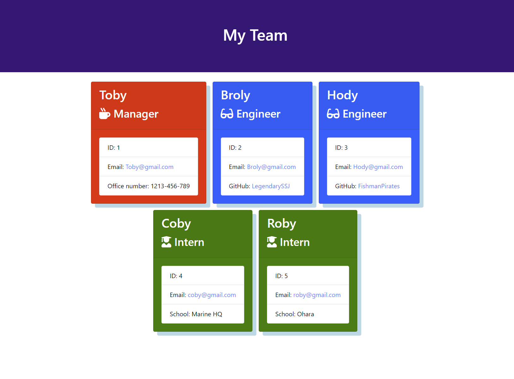

# Team Profile Generator

## Description

This project was created to allow users to create a graphical representation of a team involving a manager, engineers and interns. The aim was to be able to use the terminal to input information on team members to generate profile cards that clearly show the members and their roles. The project meets the following criteria:

* To be able to input data into a series of prompts on the terminal
* For the answers inputted to be used to generate the profile cards for each employee.
* The outputted HTML page opens a page showing the cards in a way that is easy to view.

The main things I've learned from this project are:

* How to use the file system node package to create files and folders using node
* Practice with asynchronous functions.

## Table of Contents

- [User Story](#user-story)
- [Installation](#installation)
- [Usage](#usage)
- [Credits](#credits)
- [License](#license)

## User Story

```md
AS A manager of developers
I WANT to put my team on our company's organisational chart
SO THAT I other colleagues can quickly understand how my team is comprised at a glance.
```

## Installation

For this project, the developer tool I'll be using is VS Code. A lightweight IDE that allows working in JavaScript. It also allows the use of Extensions which can add extra functionality to the tool to help with debugging and making code more readable. The main tool I'll be using is called, Node. Node allows the use of packages such as Inquirer and the ability to run JavaScript without the use of a browser.

Once Node is installed, run the following command from the folder containing, <b>index.js</b>, to start the application.
```md
npm i
```

The package.json file includes the necessary dependencies to run the application.

## Usage

Once the dependencies have been installed, run the following command from the folder containing the <b>index.js</b> file to start the application:
```md
node index.js
```
A series of prompts will appear in the console asking for information regarding each employee.
After the manager information is entered, after each new employee is added, the console will log the current team members.
The application will stop running once the finished option is selected which will generate the "team.html" file in a folder called "output".
Open the team.html file in a web browser you will see something resembling the screenshot below:

Screenshot of the final application:


## Credits

Assets in this project belong to the edX organisers. All additional work added by myself can be seen in the commit history of the repository.

## License
### MIT License

Copyright (c) 2024 Saif-Uddin-93

Permission is hereby granted, free of charge, to any person obtaining a copy of this software and associated documentation files (the "Software"), to deal in the Software without restriction, including without limitation the rights to use, copy, modify, merge, publish, distribute, sublicense, and/or sell copies of the Software, and to permit persons to whom the Software is furnished to do so, subject to the following conditions:

The above copyright notice and this permission notice shall be included in all copies or substantial portions of the Software.

THE SOFTWARE IS PROVIDED "AS IS", WITHOUT WARRANTY OF ANY KIND, EXPRESS OR IMPLIED, INCLUDING BUT NOT LIMITED TO THE WARRANTIES OF MERCHANTABILITY, FITNESS FOR A PARTICULAR PURPOSE AND NONINFRINGEMENT. IN NO EVENT SHALL THE AUTHORS OR COPYRIGHT HOLDERS BE LIABLE FOR ANY CLAIM, DAMAGES OR OTHER LIABILITY, WHETHER IN AN ACTION OF CONTRACT, TORT OR OTHERWISE, ARISING FROM, OUT OF OR IN CONNECTION WITH THE SOFTWARE OR THE USE OR OTHER DEALINGS IN THE SOFTWARE.

## Badges


